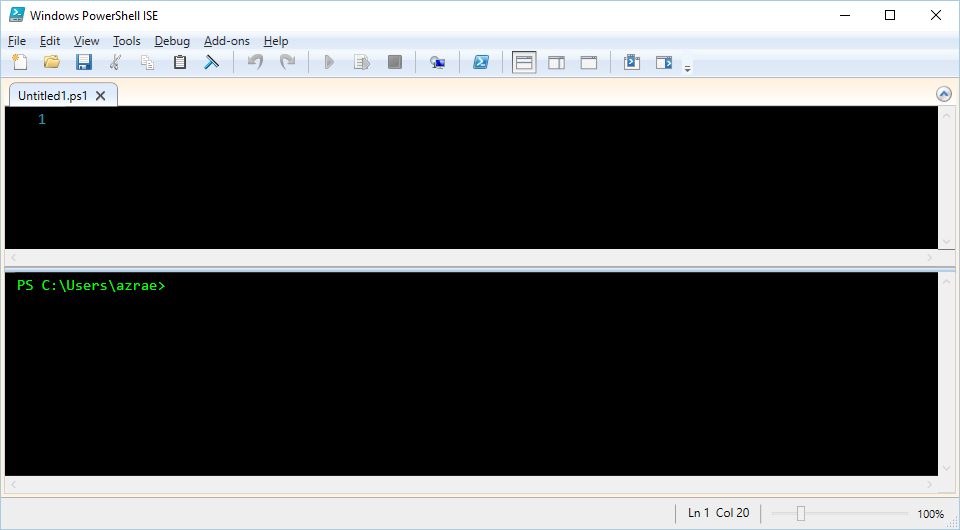
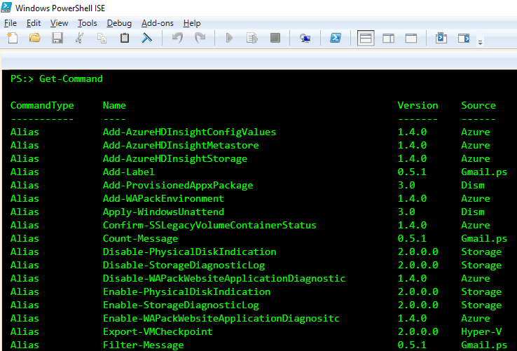
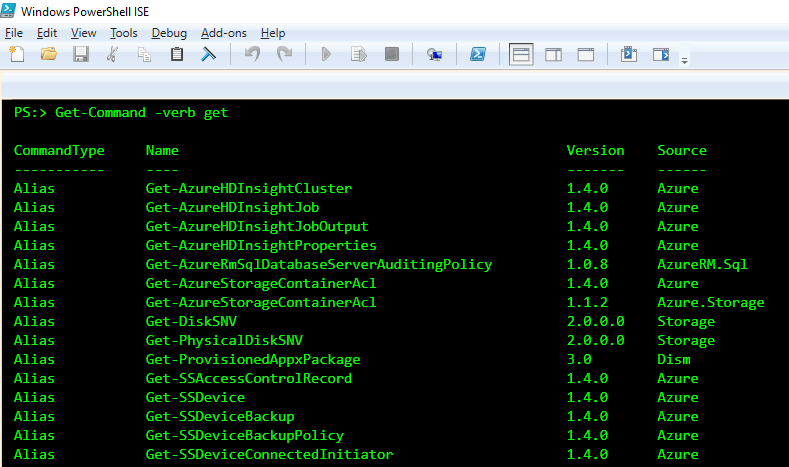
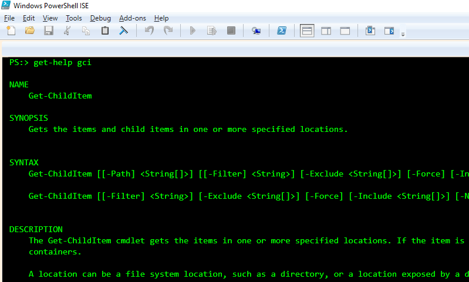
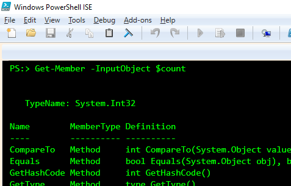

>If you repeat it, PowerShell it.

I like making my everyday job easier so scripting repeat things I do every day is key for me. I found that if I am typing something more than once a day I might as well create a script to automate this process.
Some ways that I use PowerShell everyday is for instance:
**Clearing internet cache, Lookups in SQL databases, Run Stored Procedures, Connect RDP automatically, bring text into my clipboard, Search multiple text files, and the list goes on and on.**

If are familiar with the .Net Framework you can also tap into any commands available on Windows. So basically all windows machines by default have PowerShell built into it.

Currently there are 6 versions of PowerShell and to check what version you have on your machine just go into PowerShell and run the command \$PSVersionTable and the Version is your version number of PowerShell.

_\*PowerShell is also available in Linux._

## How to find PowerShell on your computer

Using Windows 10, 8, 7:
Click Start button and start typing PowerShell and you will see many different types. The best one to start with in my opinion is PowerShell ISE.

The PowerShell ISE is Microsoft's PowerShell default script IDE.



The top part is for script files that you can test out your script and then get the results on the bottom. You can customize the layout any way you like.
Next, if you are going to be creating scripts then you should set the security of PowerShell to allow you to run scripts.

## First things first

If you plan on creating any script files the first command you should execute inside PowerShell is this one.

    Set-ExecutionPolicy -ExecutionPolicy Bypass -Scope CurrentUser

PowerShell also allows you to use the up arrow to get the last command executed.

By default, PowerShell doesn't allow outright execution of ps1 files(scripts). So you must tell PowerShell that the security must allow the current user to execute scripts.
This is not mandatory when first learning PowerShell and it is setup so that you cannot mess up anything in the Operating system by default.

## Powershell Profiles

Each PowerShell window that you open has an associated profile that is a file located in various places inside Windows.
If you type:

    $profile

You will see the path and name of your profile location.
If you want you can put in this command to open your profile inside of Notepad.

     notepad \$profile

Once in your profile file you can add PowerShell code to run every time you first start it. For instance, you can use the code below to get all the paths located in your System Environment variables and save them as PSDrives.

### Profile example code

    $names = [Environment+SpecialFolder]::GetNames([Environment+SpecialFolder])

    foreach($name in $names)
    {
        if($path = [Environment]::GetFolderPath($name)){
            New-PSDrive -Name $name -PSProvider FileSystem -Root $path | Out-Null
        }
    }

This allows me to select a drive or location and navigate there quickly. Such as this one called desktop and it takes me directly to my desktop.

    cd desktop:

## Basic Syntax

Wikipedia has the best interpretation/definition of PowerShell.

> PowerShell (including Windows PowerShell and PowerShell Core) is a task automation and configuration management framework from Microsoft, consisting of a command-line shell and associated scripting language built on the .NET Framework.
> &mdash; Wikipedia

### Variables

All variables start with a \$ Dollar sign. This signifies a variable and there are several different types:

|  Data Type Name   |                Description                |
| :---------------: | :---------------------------------------: |
|      [Array]      |                   Array                   |
|      [Bool]       |          Value is TRUE or FALSE           |
|    [DateTime]     |               Date and time               |
|      [Guid]       |    Globally unique 32-byte identifier     |
|    [HashTable]    | Hash table, collection of key-value pairs |
|  [Int32], [Int]   |              32-bit integers              |
|    [PsObject]     |             PowerShell object             |
|      [Regex]      |            Regular expression             |
|   [ScriptBlock]   |          PowerShell script block          |
| [Single], [Float] |           Floating point number           |
|     [String]      |                  String                   |
|     [Switch]      |        PowerShell switch parameter        |
|    [TimeSpan]     |               Time interval               |
|   [XmlDocument]   |               XML document                |

You can create a variable with a $ dollar sign or you can put the data type first then the $ dollar sign.

    $test = "testing"
       [string]$teststring = "testing"

Both variables are of type string.

You can also use it like a calculator

    $count = 1
    $count += 1
    $count
    2

You also have access to .Net methods inside PowerShell.

    [Math]::pow(2,2)
    4

This is the Math class using the method pow which takes two integers and the first one is value and the second is the power.

## PowerShell basic cmdlets to get started with

The three basic cmdlets to get started with right away are:

1. [Get-Command](http://ss64.com/ps/get-command.html)
2. [Get-Help](http://ss64.com/ps/get-help.html)
3. [Get-Member](http://ss64.com/ps/get-member.html)

The basic syntax of all PowerShell commands follow a pattern. That pattern is Verb-Noun. So you can see by applying this to these three commands its Get and then whatever it is you are using.

1. **Get-Command** - This will get all the commands available to you in your current session.



This is useful because now you know what commands are available to you.

To search on a specific verb you can use this command:

    Get-Command -verb get



2. **Get-Help** - This is especially helpful to get the exact properties of a command or variable that PowerShell has available.
   To get all help then type:
   `Get-Help`
   Or you can lookup a specific command like this gci which is an alias for [Get-ChildItem](http://ss64.com/ps/get-childitem.html) which is PowerShell's version of dir in Shell or ls in Linux)
   `Get-Help gci`
   
   As you can see the [Get-Help](http://ss64.com/ps/get-help.html) gives you the description and syntax. I find this extremely helpful when I need a quick example of how to correctly execute a command. You can also use parameter -Full to display the entire help file of a command.

3. **Get-Member** - This command gives us information about the object's properties and Methods.
   For an example of how this works lets go back to our earlier example:

   ```
   $count = 1

   Get-Member -InputObject

   $count
   ```

   The output shows us that the variable we created is an Int32 variable.
   

This is just a quick preview of what PowerShell is capable of next I want to delve into creating functions which is a great way to put tasks into one easy command to execute your scripts.
